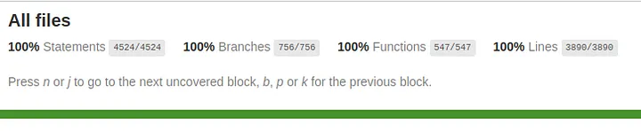
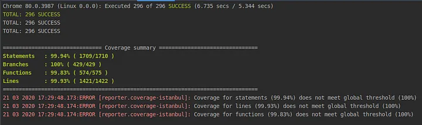
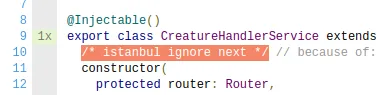
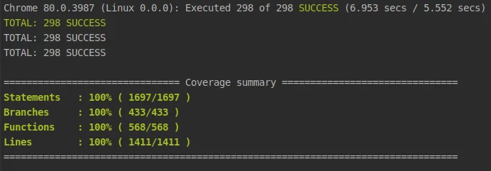

# Why I set my unit test coverage threshold to 100%

_Source of_ https://medium.com/@borzifrancesco/why-i-set-my-unit-test-coverage-threshold-to-100-4c7138276053

Every time I mention about 100% coverage, there is always at least one engineer in the room saying that it’s pointless.

_As there are different types of coverage, in this article I’ll implicitly mean by “coverage” all traditional_ [_unit test coverage criteria_](https://en.wikipedia.org/wiki/Code_coverage#Coverage_criteria) _(statements, branches, function, lines) as the concepts below apply to all of them._

## The main argument against 100% coverage

> Having 100% coverage does not ensure you that your code is properly tested

I’ve heard that so many times in my career. And what I find special about that, it’s that **I completely agree with it**.

The coverage does not tell you whether your test is good or not, but only what parts of your code have been executed during your test run. For example, your test could potentially execute all lines of code, giving you 100% coverage. However, without the proper assertions, your test will probably not catch many potential bugs.

## Coverage as a tool

I always like to see the **code coverage as a tool, not as a goal**. The code coverage report is able to tell you what lines of code are **not**properly tested. Because you haven’t tested them at all. But it can’t tell you much about the rest.

In other words, if the coverage report is saying that 80% of your code has been covered by your tests, **what it’s really telling you is that at least 20% of your code has not been tested at all**. It can’t give you an overview of the quality of your tests that are covering the remaining 80% of your code _(do your tests include the right expectations? Do they cover all business scenarios? Will they give you a meaningful error when they fail? Taking care of all of that is up to you)_.

Therefore I like to see the code coverage report as a tool that is able to warn me whenever I forget to test some parts of my code.

## Setting a coverage threshold lower than 100%

In my opinion, there is not much gain in keeping a code coverage threshold lower than 100%.

_How do you decide what code should be tested and what shouldn’t? How do you make sure you are not forgetting to cover something important?_

The code coverage report is an **average** of the coverage of all files. This can create problems.

For example, imagine a big project with a threshold set to 90% and current coverage of 95%. That sounds good, right? Well, it isn’t. As new files could be introduced with poor tests or no tests at all. It will decrease the overall coverage to 94% but your CI will still pass as the threshold is 90%. Go ahead lazy engineers and push uncovered code.

## Yet reaching 100% coverage is not always easy and takes time…

_True. However, I’ve learned that it’s easier once you get used to it._

I won’t discuss the benefits of unit testing here, but I want to mention how writing unit tests really helps you to write better code. Sometimes code can be hard to be unit tested just because it is poorly designed.

So forcing yourself to test all of your code sometimes means also forcing yourself to write better code.

Ok… but what if I can’t or don’t really want to cover a specific piece of code?

## Exceptions are always possible

You may have plenty of reasons not to cover a certain line of code.

Sometimes, no matter how good you and your code architecture are, you can’t simply reach some line while unit testing (_even though I’ve learned that this kind of case is actually rarer than one might think_).

Or maybe you are in a hurry and you want to push some code to the master branch _ASAP_ and without writing tests. Maybe you are dealing with legacy code, written by someone else several years ago, and you don’t want to test it because you plan to change it anyway.

Whatever your reasons and opinions are, **there might be exceptions**.

## How to deal with 100% coverage threshold and exceptions

My strategy is: to **make only intentional exceptions**.

Set your project’s coverage threshold to 100%. Then, when you decide to leave some code uncovered by tests, **exclude it manually** from the coverage. Possibly, add a comment explaining why that code shouldn’t or can’t be tested (or maybe a _TODO_ if you plan to do it later).

Using this strategy you will have several benefits:

*   You will never forget to leave some code uncovered by mistake
*   You will have full control and know exactly what code will be uncovered because you decided it
*   You will avoid others pushing uncovered code into the project, your build will automatically fail and prevent PRs from being merged to the master branch when tests are missing
*   You will force yourself and your team to test more and skip testing only when you have a good reason

## Conclusion

Unit test code coverage is a useful measure for software development. You should use it as a tool and not as a goal. You should be aware that code coverage can’t tell you much about the quality of your tests, it only tells you what code hasn’t been tested at all.

Keeping a threshold of 100% code coverage and manually making exceptions when you need to exclude code from coverage is a good way to keep things under control and prevent uncovered code from getting to your master branch unintentionally.
